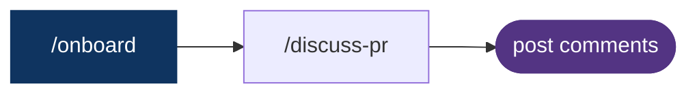
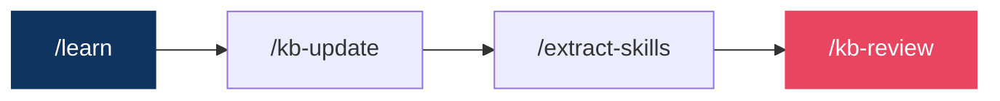
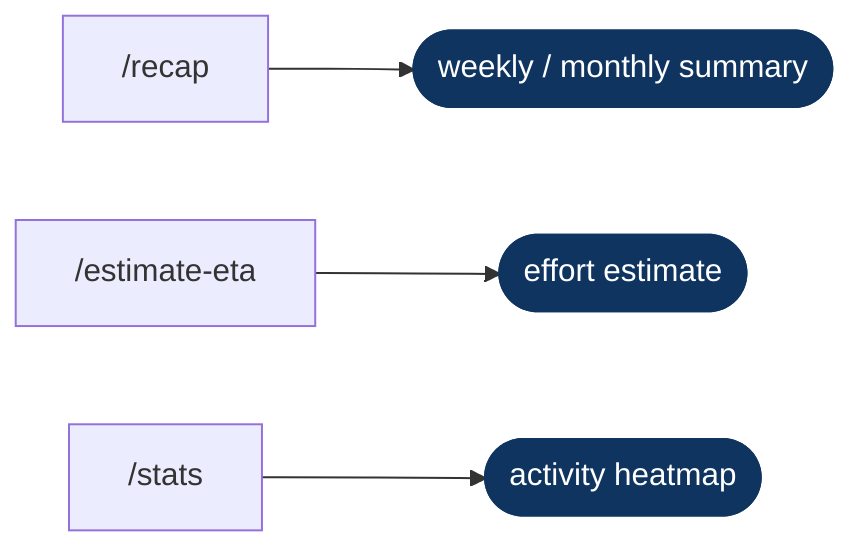
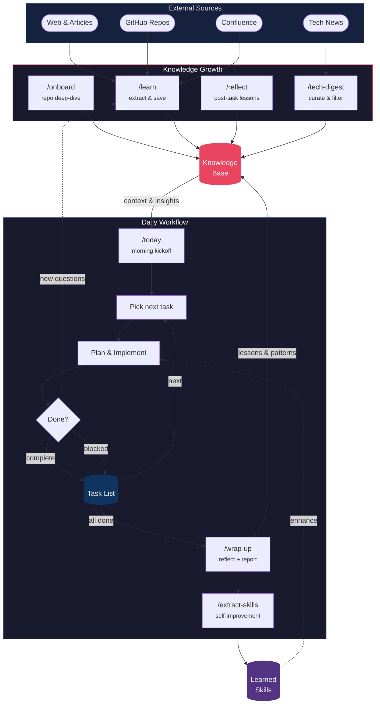

# nase — An all-in-one modern software engineering kit for Claude Code


A [Claude Code](https://claude.ai/code) kit for AI-assisted software engineering across multiple repositories. Gives you slash commands for onboarding repos, tracking knowledge, generating reports, and auto-backing up your work — all inside Claude Code.

> **Name origin**:
> - **nase** stands for ***N***ot ***A*** ***S***oftware ***E***ngineer or ***N***ot ***A***I ***S***oftware ***E***ngineer
> - **nase** sounds like 那谁 (*nà shuí*) in Chinese — the casual "hey, whatsyourname" you say when summoning someone whose name you can't be bothered to remember: *"oi, whatsyourname, come take care of this."* A fitting name for an AI you summon to handle engineering tasks.

---

## Quick start

```bash
git clone https://github.com/anels/nase.git my-workspace
cd my-workspace
claude                        # open Claude Code in this directory
```

Then inside Claude Code:

```
/nase:init                    # set AI name, configure backup & language, create workspace/
/nase:onboard /path/to/repo   # onboard a repo (local path or GitHub URL)
/nase:onboard                 # refresh ALL already-onboarded repos from workspace/context.md
/nase:today                   # morning kickoff — what to focus on today
```

That's it. The workspace is ready. Run `/nase:help` anytime for a full command overview.

Optionally, add to your PowerShell profile (`$PROFILE`) to launch nase from anywhere:

```powershell
# Claude Code — nase workspace
function Invoke-NaseClaude { Set-Location "$HOME\playground\aiteam\nase-01"; claude --dangerously-skip-permissions @args }
Set-Alias -Name nase -Value Invoke-NaseClaude
```

Then just run `nase` in any terminal to jump into the workspace and open Claude Code.

### Prerequisites

- **[Claude Code CLI](https://docs.anthropic.com/en/docs/claude-code)** — required
- **Git** — required for hooks and report commands
- **7z** — required for zip backups (`scoop install 7zip` on Windows)

#### MCP servers (optional but recommended)

| MCP | Used for | Setup |
|-----|----------|-------|
| **Atlassian** (Confluence + Jira) | `/nase:onboard` reads Confluence docs; Jira ticket lookup in reports | [Atlassian MCP](https://github.com/atlassian/mcp-atlassian) |
| **GitHub** | PR links in reports; code review commands | [GitHub MCP](https://github.com/github/github-mcp-server) |
| **Slack** | `/nase:request-review` — resolves GitHub handles to Slack users and sends DMs | [Slack MCP](https://github.com/modelcontextprotocol/servers/tree/main/src/slack) |

Configure in your Claude Code `settings.json` (or `settings.local.json`) under `mcpServers`.

---

## Why nase?

Most Claude Code setups are a collection of prompts. nase is a **persistent AI engineer workspace** — it has an identity, remembers what it learned yesterday, knows your repos, and improves its own skills over time. Here's why that matters:

- **You stay in the driver's seat** — nase doesn't try to replace you. Every design decision, every PR, every Slack message goes through you first. It handles the grunt work; you keep the judgment calls. Discuss, decide, then delegate execution.

- **Both you and the AI get smarter** — every session feeds lessons, patterns, and KB entries back into the workspace. The AI gains richer context over time, and you build a personal knowledge base of techniques, root causes, and architectural decisions that compounds across projects.

- **One workspace, all your repos** — no switching between directories, no re-explaining context. Onboard any repo once, and its architecture, constraints, and conventions are available in every future session. Work across multiple codebases without losing your place.

- **Daily lifecycle with built-in reflection** — morning kickoff → focused work → end-of-day wrap-up. Daily logs, task tracking, and structured reflections help you understand your own work patterns, spot recurring blockers, and measure where time actually goes.

- **Deep integration with your toolchain** — Jira, Confluence, Slack, and GitHub are first-class citizens, not afterthoughts. Look up tickets, cross-reference docs, ping reviewers, and address PR comments — all without leaving the chat. This collapses the context-switching tax that eats most of a developer's day.

- **Skills that write skills** — solve a hard problem once, then `/extract-skills` turns it into a reusable slash command. The workspace literally programs itself — your past work becomes tomorrow's automation.

- **Persistent and portable** — the knowledge base, logs, and skills survive session resets. Auto-backup to OneDrive (or any path) means a machine swap doesn't erase months of accumulated context.

---

## Features

- **Persistent knowledge base** — each repo gets its own `workspace/kb/projects/<repo>.md`; stack-level patterns go in `workspace/kb/general/`. Only the relevant domain file is loaded per task, keeping context lean.
- **Daily workflow out of the box** — morning: `/nase:today` → work: `/nase:onboard <repo>` + `/nase:learn <url>` → evening: `/nase:wrap-up` (autonomous: reflect → learn → extract-skills → kb-update → journal).
- **Learn from anything** — `/nase:learn` accepts plain text, GitHub repo URLs, or article URLs. Fetches content, filters for your stack, extracts learnings, and writes to `lessons.md` + the appropriate KB domain file.
- **Tech digest on autopilot** — `/nase:tech-digest` fetches configured sources (blogs, changelogs, HN), filters for your stack, and prepends a dated digest to `tech-trends.md`. Entries older than 30 days are archived automatically.
- **Self-programming** — `/nase:extract-skills` analyzes the current session, identifies reusable patterns, and saves them as slash commands under `workspace/skills/`. See [Grow the knowledge base into new skills](#grow-the-knowledge-base-into-new-skills).
- **Auto-backup** — a `Stop` hook runs at every session end, creating a timestamped zip of `workspace/` at your configured backup path. Configurable retention policy (keep last N backups or last N days) cleans up old archives automatically.

---

## Use cases

### Implement a fix or new feature

- **Idea to merged PR without leaving the chat** — onboard repo context, brainstorm the approach, then let `/fsd` drive the full cycle autonomously: code → test → fix loop → commit → push → draft PR
- **Smart reviewer discovery** — finds the right people by mining KB for domain experts, then git history for recent contributors, then CODEOWNERS as fallback
- **Interactive feedback loop** — walks through review comments with you: auto-fixes the obvious ones, discusses ambiguous ones 1-by-1
- **You decide, nase executes** — you stay in the driver's seat on design decisions; nase handles the grunt work end-to-end


```
/nase:onboard <repo>          # load repo context into KB
  brainstorm / plan            # clarify requirements, design approach
/nase:fsd <task>               # autonomous: implement → test → commit → push → draft PR
                               #   (fsd will ask if you want to request review at the end)
/nase:request-review <PR-URL>  # find right reviewers and ping them on Slack
  ⏳ wait for feedback
/nase:address-comments <PR-URL># discuss or auto-fix each comment → push
  ⏳ wait for approval
/nase:prep-merge <PR-URL>      # rebase, squash, clean up, un-draft, request review
  merge ✓
```

### Review someone else's PR

- **A review partner, not an auto-approver** — nase loads the repo's KB, cross-references Confluence docs and git history, then *discusses* the PR with you
- **Deepens your understanding** — asks questions, challenges assumptions, surfaces architectural risks and subtle bugs that a context-free linter would miss; you learn the codebase faster and catch things you'd otherwise skim past
- **Knowledge compounds** — insights from the discussion feed back into the KB, so every review makes future reviews sharper
- **You stay in control** — nase drafts inline comments; you review, edit, and post manually



```
/nase:onboard <repo>           # ensure KB is fresh for this repo
/nase:discuss-pr <PR-URL>      # deep analysis — architecture, bugs, security, patterns
                               #   produces inline comment drafts in chat
  review drafts, edit, post manually on GitHub
```

### Grow the knowledge base into new skills

- **Knowledge that persists** — most AI setups forget everything between sessions; nase captures lessons, articles, and patterns into a structured KB that survives session resets
- **The workspace programs itself** — `extract-skills` turns recurring patterns into reusable slash commands; you solve a problem once, then never again
- **KB stays lean** — periodic `kb-review` deduplicates, cross-references, and prunes stale entries instead of letting it become a junk drawer
- **Example — cross-repo automation**: you update a GitHub Actions workflow in one repo and realize every onboarded repo needs the same change. Because nase already knows each repo's structure, CI config, and branch conventions from the KB, you can extract a skill that iterates over all onboarded repos, creates a worktree, applies the change, and opens a draft PR in each — hours of manual context-switching become a single slash command



```
/nase:learn <url-or-tip>       # capture an article, technique, or lesson
/nase:kb-update                # persist session learnings into KB
/nase:extract-skills           # analyze session → extract reusable patterns as workspace skills
/nase:kb-review                # periodically: deduplicate, cross-reference, clean up stale entries
```

### Track progress and report

- **Structured recaps on demand** — `/recap` generates a weekly or monthly summary from daily logs, commits, and task completions — no manual note-taking required
- **Effort estimation** — `/estimate-eta` breaks down a task and gives a calibrated estimate based on KB context and historical patterns
- **Usage analytics** — `/stats` shows a GitHub-style heatmap of your skill usage and workspace activity



---

## Available commands

### Setup & health

| Command | Purpose |
|---------|---------|
| `/nase:init [name]` | First-time setup: set AI name, configure backup & language, initialize `workspace/`; offers to restore from backup on fresh init |
| `/nase:doctor` | Self-diagnostic: verify hooks, backup config, workspace/ structure, tools |
| `/nase:help` | Show usage guide and command overview |

### Knowledge base

| Command | Purpose |
|---------|---------|
| `/nase:onboard` | Refresh ALL already-onboarded repos from `workspace/context.md` (run at session start) |
| `/nase:onboard <path-or-url>` | Onboard or refresh a single repo (local path or GitHub URL) |
| `/nase:tech-digest` | Fetch latest tech news → `workspace/kb/general/tech-trends.md` |
| `/nase:kb-update [domain]` | Update knowledge base with session learnings |
| `/nase:kb-review [scope]` | Review, organize, and consolidate KB — deduplicate, cross-reference, surface stale content |
| `/nase:kb-teamshare [path]` | Export selected KB files and workspace skills as a portable, sanitized directory for teammates |
| `/nase:kb-merge [path]` | Import and merge a teammate's shared KB into your local `workspace/kb/` |

### Learning & reflection

| Command | Purpose |
|---------|---------|
| `/nase:today` | Morning kickoff: auto-sync PR/Jira statuses in todo + efforts, surface scheduled maintenance, then show focus + priorities + blockers |
| `/nase:learn [tip\|url]` | Capture a tip, or feed a URL (article/repo) → auto-extract learnings → `workspace/tasks/lessons.md` + relevant KB file |
| `/nase:reflect [task]` | Post-task reflection |
| `/nase:extract-skills` | Analyze current session → extract reusable patterns as files under `workspace/skills/` |
| `/nase:wrap-up [force]` | End-of-day routine: reflect → learn → extract-skills → kb-update → journal entry → `workspace/journals/YYYY-MM-DD.md` |

### Autonomous execution

| Command | Purpose |
|---------|---------|
| `/nase:fsd <task>` | Full Self-Develop — ask options upfront, then implement → build → test (fix loop) → simplify → commit → push → draft PR → cleanup, fully autonomous |

### Git workflow

| Command | Purpose |
|---------|---------|
| `/nase:improve-commit-message` | Rewrite last commit message to conventional commits format |
| `/nase:request-review <PR-URL(s)>` | Find reviewers (KB → git history → CODEOWNERS) and send Slack DMs |
| `/nase:discuss-pr <PR-URL>` | KB-driven PR review discussion in chat; reads & engages existing review comments (+1/reply/discuss), drafts inline comments for manual posting, triggers KB update on confirmed findings |
| `/nase:address-comments <PR-URL>` | Auto-fix or discuss unresolved PR comments 1-by-1, then push, resolve, and capture learnings to KB |
| `/nase:prep-merge <PR-URL>` | After multiple review iterations, commit history gets messy and PR title/description drift from the final state — rebase on the target branch, squash commits, verify comments resolved, rewrite PR title/description to match what was actually delivered, then optionally un-draft and request review |

### Reporting

| Command | Purpose |
|---------|---------|
| `/nase:recap [week\|last week\|month\|last month\|YYYY-MM-DD to YYYY-MM-DD]` | Structured recap of work over a period (weekly Mon–Sun, monthly 1st–last day) → chat + auto-saves to `workspace/recaps/` |
| `/nase:estimate-eta <task>` | Effort estimate |
| `/nase:stats [7\|30\|all]` | Workspace usage statistics with GitHub-style heatmap → chat summary + `workspace/stats/report-YYYY-MM-DD.md` |

### Backup & restore

| Command | Purpose |
|---------|---------|
| `/nase:restore` | Restore `workspace/` from a zip backup (lists available backups, lets you pick one) |

---

## How it works

Two feedback loops drive continuous improvement: **knowledge accumulation** feeds into **daily workflow**, and daily work feeds back into knowledge.

<details>
<summary>Workflow diagram (click to expand)</summary>



</details>

> **Knowledge growth** (top): `/onboard`, `/learn`, `/reflect`, and `/tech-digest` continuously feed the Knowledge Base from internal docs, external articles, GitHub repos, and tech news.
>
> **Daily workflow** (middle): `/today` kicks off the day → prioritize from the todo list → brainstorm & plan → implement. Each task either completes or gets marked as blocked — both update the todo list and loop back to pick the next item. When all tasks are done, `/wrap-up` closes the day, feeds lessons back into the KB, and triggers `/extract-skills` to capture reusable patterns as personal skills that enhance future work.
>
> The loops reinforce each other: richer knowledge → better daily decisions → more lessons captured → even richer knowledge.

---

## Automatic hooks

| Hook | When | What it does |
|------|------|--------------|
| `SessionStart` | Every new Claude Code session | Creates `workspace/logs/YYYY-MM-DD.md` if missing; alerts if last backup had an error or target is unreachable; archives tech digest entries older than 30 days; suggests `/nase:reflect` if you made commits today |
| `Stop` | Every session end | Surfaces pending todos from `workspace/tasks/todo.md`; appends today's commit summary to the daily log; warns if no session notes were written; creates a timestamped zip backup of `workspace/` → backup target; applies retention cleanup; writes status to `workspace/logs/.backup-status` |
| `PreToolUse` + `PostToolUse` | Before/after every `Skill` tool call | Records `/nase:*` invocations as `{"skill","ts"}` to `workspace/stats/skill-usage.jsonl`; dual-hook improves coverage (PostToolUse alone misses some invocations); same-second dedup prevents double-counting; used by `/nase:stats` |
| `WorktreeCreate` / `WorktreeRemove` | When a git worktree is created or removed | Appends a timestamped entry to today's daily log (`worktree created: <path>` / `worktree removed: <path>`) |

The `Stop` hook reads `backup-target` from `.local-paths` at the workspace root (set by `/nase:init`). If the file doesn't exist, it silently skips.

> **Initialization order**: Run `/nase:init` before the first `Stop` hook fires — it creates `.local-paths`. The `SessionStart` hook creates the daily log immediately and works without any setup.

---

## Workspace structure

### Kit (tracked in git)

```
nase/
  .claude/
    commands/nase/      ← Claude Code slash commands (pre-built)
      init.md
      doctor.md
      help.md
      today.md
      onboard.md
      tech-digest.md
      kb-update.md
      learn.md
      reflect.md
      extract-skills.md
      wrap-up.md
      fsd.md
      estimate-eta.md
      improve-commit-message.md
      request-review.md
      discuss-pr.md
      address-comments.md
      prep-merge.md
      restore.md
      stats.md
    hooks/              ← Hook scripts (called by settings.json)
      session-start.sh
      stop-todos.sh
      stop-backup.sh
      track-skill.sh
      worktree-log.sh
    settings.json       ← Claude Code hooks (SessionStart + Stop + PostToolUse + WorktreeCreate/Remove)
  CLAUDE.md             ← AI identity + operating rules (loaded by Claude Code automatically)
  README.md             ← this file
```

### `workspace/` directory (git-ignored, created by `/nase:init`)

```
workspace/
  config.md               ← AI engineer name + workspace name + backup retention + language config (managed by /nase:init)
  context.md              ← repo list + domain patterns
  tech-digest-config.md   ← personal sources + filter topics for /nase:tech-digest
  kb/
    .domain-map.md    ← project-domain → kb file mappings (managed by /nase:onboard)
    projects/         ← one file per repo (architecture, constraints, patterns)
    general/
      workflow.md     ← commit rules, PR process, coding principles
      debugging.md    ← debugging techniques, past root causes
      <your-stack>.md ← patterns for your primary stack (e.g. dotnet.md, spark-scala.md)
      tech-trends.md  ← monthly rolling tech digest (auto-appended by /nase:tech-digest)
      tech-trends-archive-YYYY.md  ← entries older than 30 days (auto-archived)
    ops/              ← deployment/ops knowledge by deployment type (see workspace/kb/.domain-map.md for known types)
  stats/
    skill-usage.jsonl ← append-only log of /nase:* invocations (auto-written by PostToolUse hook)
    report-YYYY-MM-DD.md ← detailed stats report (written by /nase:stats)
  logs/               ← daily work logs + .backup-status (auto-managed by hooks)
  journals/           ← end-of-day wrap-up files (written by /nase:wrap-up, one per day)
  recaps/             ← weekly/monthly recap reports (written by /nase:recap)
  skills/             ← auto-extracted reusable patterns (written by /nase:extract-skills; gitignored)
  efforts/            ← design docs with lifecycle tracking (written by /nase:design; completed efforts move to efforts/done/)
  tasks/
    lessons.md        ← accumulated lessons from /nase:learn and /nase:reflect
    todo.md           ← current task tracking
```

`.local-paths` is at the **workspace root** (not inside `workspace/`) so it survives a `workspace/` deletion or restore scenario.

| Path | In git? | Reason |
|------|---------|--------|
| `.claude/` | Yes | Shared workflow improvements |
| `CLAUDE.md` | Yes | Identity + operating rules |
| `README.md` | Yes | Usage guide |
| `.local-paths` | No | Machine-specific paths (backup + repo paths) |
| `workspace/` | No | Project-specific content |

---

## Configuration

The kit (`.claude/`, `CLAUDE.md`, `README.md`) is tracked by git. Your work content (`workspace/`) is git-ignored and stays local. `git pull` updates only kit files, never your content.

**Customizing for your stack:**

- **Add KB domains**: create `workspace/kb/general/<domain>.md` and edit `workspace/kb/.domain-map.md`
- **Add a repo**: `/nase:onboard <path-or-url>` — creates the KB entry and updates `workspace/context.md`; run `/nase:onboard` (no args) to refresh all repos at once
- **Change tech news sources**: edit `workspace/tech-digest-config.md`
- **Change AI identity**: run `/nase:init` or edit `workspace/config.md`
- **Change backup location**: edit the `backup-target=` line in `.local-paths` at the workspace root
- **Change backup retention**: edit `backup_retention:` in `workspace/config.md` (e.g. `count:100` or `days:7`)

> **Input formats**: `/nase:onboard` accepts Windows paths (`C:\foo\bar`), Git Bash paths (`/c/foo/bar`), and GitHub URLs (`https://github.com/Org/Repo` or `git@github.com:Org/Repo.git`). GitHub URLs are resolved to local paths via `.local-paths` — no cloning or network access required.

**Contributing:**

Found a bug or have a suggestion? [Open an issue](https://github.com/anels/nase/issues).
