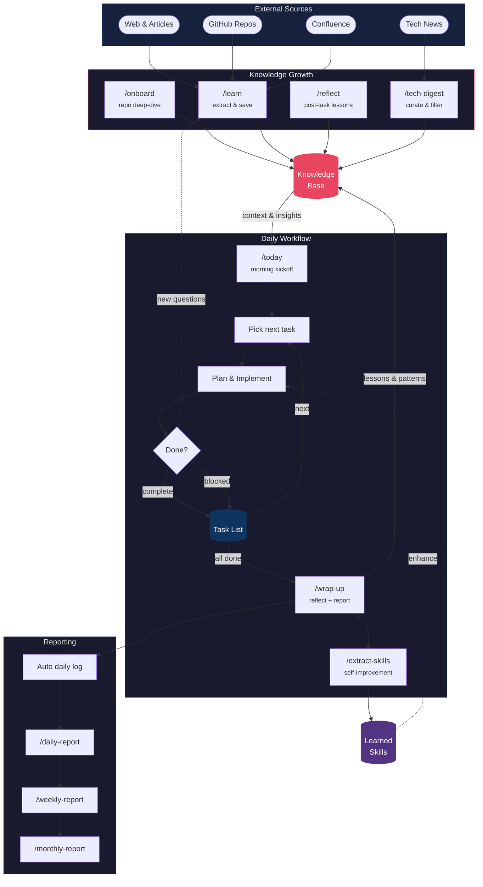

# nase — Not A(i) Software Engineer

A [Claude Code](https://claude.ai/code) workspace template for an AI engineer working across multiple repositories. Gives you slash commands for onboarding repos, tracking knowledge, generating reports, and auto-backing up your work — all inside Claude Code.

> **Name origin**: "nase" sounds like 那谁 (*nà shuí*) in Chinese — the casual "hey, whatsyourname" you say when summoning someone whose name you can't be bothered to remember: *"oi, whatsyourname, come take care of this."* A fitting name for an AI you summon to handle engineering tasks.

> **Requires:** Claude Code CLI. All `/nase:*` commands are Claude Code slash commands — they won't work in other tools.

---

## Quick start

```bash
git clone https://github.com/anels/nase.git my-workspace
cd my-workspace
claude                        # open Claude Code in this directory
```

Then inside Claude Code:

```
/nase:init                    # set AI name, configure backup, create work/
/nase:onboard /path/to/repo   # onboard your first repo (local path or GitHub URL)
/nase:today                   # morning kickoff — what to focus on today
```

That's it. The workspace is ready. Run `/nase:help` anytime for a full command overview.

---

## Why nase?

Most Claude Code setups are a collection of prompts. nase is a **persistent AI engineer** — it has an identity, remembers what it learned yesterday, knows your repos, and improves its own skills over time.

Every session, nase reads your knowledge base, stays up to date with tech news in your stack, and logs what it did. Every time you solve a hard problem, you can capture it — as a lesson, as a KB entry, or as a new slash command for future use. The workspace gets smarter the longer you use it.

| Other setups | nase |
|---|---|
| Stateless — Claude forgets everything between sessions | Persistent KB survives session resets; loaded on demand |
| Generic prompts for any task | Opinionated workflow shaped to your stack — customize KB domains to match |
| Manual context management | Auto-onboards repos, auto-backs up work, auto-digests tech news |
| You write the commands | Commands write new commands (`/nase:extract-skills`) |
| One assistant, one task | Named AI identity with daily lifecycle: morning → work → wrap-up → backup |

---

## Features

**Persistent knowledge base** — Each repo gets its own `work/kb/projects/<repo>.md`. Stack-level patterns go in `work/kb/general/`. Knowledge is loaded surgically — only the relevant domain file is read, keeping context lean.

**Daily workflow out of the box** — Morning: `/nase:today`. Work: `/nase:onboard <repo>` before touching any repo; `/nase:learn <url>` to ingest an article mid-session. Evening: `/nase:wrap-up` — fully autonomous: reflect → learn → extract-skills → kb-update → daily-report, written to `work/journals/`.

**Learn from anything** — `/nase:learn` accepts plain text, a GitHub repo URL, or an article URL. For URLs, it fetches the content, filters for relevance to your stack, extracts concrete learnings, shows them to you for review, then writes to both `lessons.md` and the appropriate KB domain file.

**Tech digest on autopilot** — `/nase:tech-digest` fetches your configured sources (blogs, changelogs, HN), filters for your stack, and prepends a dated digest to `tech-trends.md`. Entries older than 30 days are archived automatically.

**Skills that write skills** — `/nase:extract-skills` analyzes the current session, identifies reusable patterns, and saves them as pattern files under `work/skills/`. These are user-specific and gitignored — the workspace literally programs itself.

**Auto-backup with hooks** — A `Stop` hook runs at every session end, syncing `work/` to your configured backup path (OneDrive, local drive, etc.). An atomic in-place copy strategy ensures the backup is never left in a broken state — even on cloud-synced drives.

---

## Available commands

### Setup & health

| Command | Purpose |
|---------|---------|
| `/nase:init [name]` | First-time setup: set AI name, configure backup, initialize `work/`; offers to restore from backup on fresh init |
| `/nase:doctor` | Self-diagnostic: verify hooks, backup config, work/ structure, tools |
| `/nase:help` | Show usage guide and command overview |

### Knowledge base

| Command | Purpose |
|---------|---------|
| `/nase:onboard <path-or-url>` | Onboard a new repo (local path or GitHub URL) |
| `/nase:tech-digest` | Fetch latest tech news → `work/kb/general/tech-trends.md` |
| `/nase:kb-update [domain]` | Update knowledge base with session learnings |

### Learning & reflection

| Command | Purpose |
|---------|---------|
| `/nase:today` | Morning kickoff: today's focus + priorities + blockers |
| `/nase:learn [tip\|url]` | Capture a tip, or feed a URL (article/repo) → auto-extract learnings → `work/tasks/lessons.md` + relevant KB file |
| `/nase:reflect [task]` | Post-task reflection |
| `/nase:extract-skills` | Analyze current session → extract reusable patterns as files under `work/skills/` |
| `/nase:wrap-up [force]` | End-of-day routine: reflect → learn → extract-skills → kb-update → daily-report → `work/journals/YYYY-MM-DD.md` |

### Git workflow

| Command | Purpose |
|---------|---------|
| `/nase:improve-commit-message` | Rewrite last commit message to conventional commits format |
| `/nase:update-changelog [version] [from <ref>] [to <ref>]` | Generate or update `CHANGELOG.md` by analyzing code changes between two git refs |

### Reporting

| Command | Purpose |
|---------|---------|
| `/nase:daily-report` | Today's AI-assisted work summary |
| `/nase:weekly-report` | Week-in-review across all repos |
| `/nase:monthly-report` | Monthly recap (includes KB freshness audit) |
| `/nase:estimate-eta <task>` | Effort estimate |

### Backup & restore

| Command | Purpose |
|---------|---------|
| `/nase:restore` | Restore `work/` from backup |

---

## How it works

Two feedback loops drive continuous improvement: **knowledge accumulation** feeds into **daily workflow**, and daily work feeds back into knowledge.

<details>
<summary>Workflow diagram (click to expand)</summary>



</details>

> **Knowledge growth** (top): `/onboard`, `/learn`, `/reflect`, and `/tech-digest` continuously feed the Knowledge Base from internal docs, external articles, GitHub repos, and tech news.
>
> **Daily workflow** (middle): `/today` kicks off the day → prioritize from the todo list → brainstorm & plan → implement. Each task either completes or gets marked as blocked — both update the todo list and loop back to pick the next item. When all tasks are done, `/wrap-up` closes the day, feeds lessons back into the KB, and triggers `/extract-skills` to capture reusable patterns as personal skills that enhance future work.
>
> **Reporting** (bottom): daily logs accumulate automatically per session, then roll up into `/daily-report` → `/weekly-report` → `/monthly-report`.
>
> The loops reinforce each other: richer knowledge → better daily decisions → more lessons captured → even richer knowledge.

---

## Automatic hooks

| Hook | When | What it does |
|------|------|--------------|
| `SessionStart` | Every new Claude Code session | Creates `work/logs/YYYY-MM-DD.md` if missing; alerts if last backup had an error or target is unreachable; archives tech digest entries older than 30 days; suggests `/nase:reflect` if you made commits today; prompts `/nase:weekly-report` if >7 days since last |
| `Stop` | Every session end | Surfaces pending todos from `work/tasks/todo.md`; appends today's commit summary to the daily log; warns if no session notes were written; syncs `work/` → backup target (in-place, OneDrive-compatible); writes status to `work/logs/.backup-status` |

The `Stop` hook reads `.backup-target` at the workspace root (set by `/nase:init`). If the file doesn't exist, it silently skips.

> **Initialization order**: Run `/nase:init` before the first `Stop` hook fires — it creates `.backup-target`. The `SessionStart` hook creates the daily log immediately and works without any setup.

---

## Workspace structure

### Template (tracked in git)

```
nase/
  .claude/
    commands/nase/      ← Claude Code slash commands (pre-built)
      init.md
      doctor.md
      help.md
      today.md
      onboard.md
      tech-digest.md
      kb-update.md
      learn.md
      reflect.md
      extract-skills.md
      wrap-up.md
      daily-report.md
      weekly-report.md
      monthly-report.md
      estimate-eta.md
      improve-commit-message.md
      update-changelog.md
      restore.md
    hooks/              ← Hook scripts (called by settings.json)
      session-start.sh
      stop-todos.sh
      stop-backup.sh
    settings.json       ← Claude Code hooks (SessionStart + Stop)
  CLAUDE.md             ← AI identity + operating rules (loaded by Claude Code automatically)
  README.md             ← this file
```

### `work/` directory (git-ignored, created by `/nase:init`)

```
work/
  config.md               ← AI engineer name + workspace name (managed by /nase:init)
  context.md              ← repo list + domain patterns
  tech-digest-config.md   ← personal sources + filter topics for /nase:tech-digest
  kb/
    .domain-map.md    ← project-domain → kb file mappings (managed by /nase:onboard)
    projects/         ← one file per repo (architecture, constraints, patterns)
    general/
      workflow.md     ← commit rules, PR process, coding principles
      debugging.md    ← debugging techniques, past root causes
      <your-stack>.md ← patterns for your primary stack (e.g. dotnet.md, spark-scala.md)
      tech-trends.md  ← monthly rolling tech digest (auto-appended by /nase:tech-digest)
      tech-trends-archive-YYYY.md  ← entries older than 30 days (auto-archived)
  logs/               ← daily work logs + .backup-status (auto-managed by hooks)
  journals/           ← end-of-day wrap-up files (written by /nase:wrap-up, one per day)
  skills/             ← auto-extracted reusable patterns (written by /nase:extract-skills; gitignored)
  tasks/
    lessons.md        ← accumulated lessons from /nase:learn and /nase:reflect
    todo.md           ← current task tracking
```

`.backup-target` is at the **workspace root** (not inside `work/`) so it survives a `work/` deletion or restore scenario.

| Path | In git? | Reason |
|------|---------|--------|
| `.claude/` | Yes | Shared workflow improvements |
| `CLAUDE.md` | Yes | Identity + operating rules |
| `README.md` | Yes | Usage guide |
| `.backup-target` | No | Personal backup path |
| `work/` | No | Project-specific content |

---

## Keeping the template updated

The template layer (`.claude/`, `CLAUDE.md`, `README.md`) is tracked by git. Your work content (`work/`) is git-ignored and stays local.

**Improve the template as you work** — When you refine a skill or discover a better workflow:
```bash
git add .claude/commands/nase/kb-update.md
git commit -m "feat(kb-update): add spark-streaming domain mapping"
git push
```

**Pull template updates** — `git pull` only updates template files, never your content.

---

## Customizing for your stack

- **Add KB domains**: create `work/kb/general/<domain>.md` and edit `work/kb/.domain-map.md`
- **Add a repo**: `/nase:onboard <path-or-url>` — creates the KB entry and updates `work/context.md`
- **Change tech news sources**: edit `work/tech-digest-config.md`
- **Change AI identity**: run `/nase:init` or edit `work/config.md`
- **Change backup location**: edit `.backup-target` at the workspace root (one line, bash-format path)

> **Input formats**: `/nase:onboard` accepts Windows paths (`C:\foo\bar`), Git Bash paths (`/c/foo/bar`), and GitHub URLs (`https://github.com/Org/Repo` or `git@github.com:Org/Repo.git`). GitHub URLs are resolved to local paths via `work/context.md` — no cloning or network access required.

---

## Prerequisites

- **[Claude Code CLI](https://docs.anthropic.com/en/docs/claude-code)** — required
- **Git** — required for hooks and report commands

### MCP servers (optional but recommended)

| MCP | Used for | Setup |
|-----|----------|-------|
| **Atlassian** (Confluence + Jira) | `/nase:onboard` reads Confluence docs; Jira ticket lookup in reports | [Atlassian MCP](https://github.com/atlassian/mcp-atlassian) |
| **GitHub** | PR links in reports; code review commands | [GitHub MCP](https://github.com/github/github-mcp-server) |

Configure in your Claude Code `settings.json` (or `settings.local.json`) under `mcpServers`.
