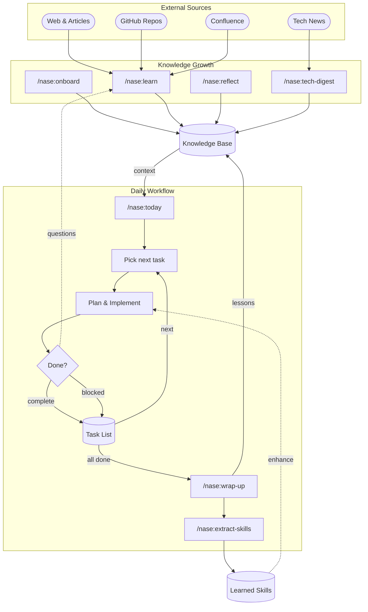

# nase architecture

How hooks, skills, KB, and feedback loops fit together. For setup and command reference, see [README.md](../README.md).

---

## Layout

```
.claude/
  agents/              project-level Claude Code subagents
  commands/nase/       compact slash-command entrypoints
    workspace/         generated /nase:workspace:* wrappers (git-ignored)
  hooks/               shell scripts wired in settings.json
  docs/                shared and on-demand phase docs referenced by skills
  scripts/             utility scripts (date resolution, KB search, stats)
  skills/              local Claude Code skills (git-ignored)
  roles.yaml           subagent model + effort routing
  settings.json        hook registrations
  settings.local.json  local settings overrides (git-ignored)
docs/                  architecture and reference docs
evals/                 offline eval cases for high-frequency skills
tests/                 local/CI validation gates
workspace/             git-ignored; per-user content
  kb/                  knowledge base (projects/, general/, ops/, cross-project/)
  efforts/, journals/, recaps/, logs/, stats/, tasks/, skills/, tmp/, ...
.local-paths           machine-specific paths (backup target, repo paths)
CLAUDE.md              identity + operating rules
README.md              setup and command reference
```

The kit (`.claude/`, `CLAUDE.md`, `README.md`, `docs/`) is checked in, except local `.claude/settings.local.json`, `.claude/skills/`, and generated `.claude/commands/nase/workspace/` wrappers. `workspace/` is git-ignored; `git pull` updates kit files only.

---

## Hooks that gate tool calls

Hooks are registered in `.claude/settings.json`. Shell output and exit codes feed back into model context.

| Hook | Event | Script | Behavior |
|------|-------|--------|----------|
| `SessionStart` | New Claude Code session | `session-start.sh` | Creates `workspace/logs/YYYY-MM-DD.md` if missing; alerts if last backup had an error or target unreachable; archives tech-digest entries older than 30 days; syncs `workspace/skills/*.md` into `/nase:workspace:*` command wrappers and removes legacy generated native mirrors; `/nase:doctor` checks source-wrapper integrity plus mirror cleanup against the ignored manifest; suggests `/nase:reflect` if commits exist for today |
| `UserPromptSubmit` | User prompt submitted | `style-edit-detect.sh` | Detects likely style corrections on Slack/PR/external-doc drafts and injects a reminder to log a `[STYLE-DELTA]` for later consolidation |
| `UserPromptSubmit` | User prompt submitted | `track-skill-prompt.sh` | Records `/nase:*` recognition as `event_type:"requested"`; recognition is not usage or success |
| `UserPromptExpansion:nase:*` | Slash command expanded | `track-skill-prompt.sh` | Records actual slash expansion as `event_type:"activated"` in `workspace/stats/skill-usage.jsonl` |
| `PreToolUse:Bash` | Before every Bash tool call | `block-dangerous-git.sh` | Rejects known destructive git patterns (see list below) before they execute |
| `PreToolUse:Bash` | Before every Bash tool call | `external-cli-write-guard.sh` | Rejects raw GitHub, ADO, Azure, Kubernetes, and Terraform mutations; fails closed for unrecognized guarded-CLI invocations; approved actions run through a payload-bound manifest |
| `PreToolUse:slack_send_message` | Before direct Slack send | `slack-send-guard.sh` | Blocks direct Slack sends; use draft messages instead |
| `PreToolUse:Jira mutations` | Before Jira writes | `jira-write-guard.sh` | Requires a fresh `workspace/.jira-write-token`; validation, atomic consumption, and audit logging share the repo-wide workspace mutation lock |
| `PreToolUse:Confluence writes` | Before Confluence page writes | `confluence-size-guard.sh` | Blocks page bodies over 60 KB to avoid truncation/partial writes |
| `PreCompact` | Before context compaction | `pre-compact-archive.sh` | Rotates `workspace/tasks/lessons.md` entries marked `> Promoted →` and older than 90 days into `lessons-archive.md` when the file exceeds 80 KB; moves `workspace/efforts/done/*.md` older than 60 days into `workspace/efforts/archive/<YYYY>/` |
| `Stop` | Every session end | `stop-todos.sh`, `stop-backup.sh` | Surfaces pending todos from `workspace/tasks/todo.md`; appends today's commit summary to the daily log; warns if no session notes were written; creates a timestamped zip backup of `workspace/` at `.local-paths`'s `backup-target`; applies retention cleanup; writes status to `workspace/logs/.backup-status` |
| `StopFailure` | Session failed before normal stop | `track-session-failure.sh` | Appends a redacted bounded failure summary to `workspace/stats/session-failures.jsonl` |
| `PostToolUse:Read` | After every `Read` tool call | `track-kb-read.sh` | Appends KB file read events to `workspace/stats/kb-usage.jsonl`; only logs `workspace/kb/**/*.md` and `workspace/kb/**/*.sql`, excludes `.domain-map.md`, and uses session-local active skill context when available |
| `PostToolUse:Skill` | After every `Skill` tool call | `track-skill.sh` | Records `tool_succeeded` or `tool_failed` with source and session ID. Usage reports count activations, then fall back compatibly for legacy records. |
| `PostToolUseFailure` | After a failed tool call | `track-tool-failure.sh` | Appends a redacted bounded tool failure summary to `workspace/stats/tool-failures.jsonl` without storing tool input |
| `PostToolUse:Edit\|Write` | After editing/writing `.sh` files | `post-edit-shellcheck.sh` | Runs `shellcheck -S warning` on the edited file and returns exit 2 with diagnostics when shellcheck fails |
| `PreToolUse:Edit\|Write\|MultiEdit` | Before editing/writing source files (non-blocking) | `pre-edit-write-fact-force.sh` | Inspired by ECC's [`gateguard-fact-force.js`](https://github.com/affaan-m/everything-claude-code/blob/main/scripts/hooks/gateguard-fact-force.js). On the first edit to a source file (`.py .ts .tsx .js .jsx .go .cs .rb .rs .java .sh .kt .swift .cpp .c .h`) per session, emits `hookSpecificOutput.additionalContext` demanding three concrete facts before the change is applied: callers, public-API impact, and the originating instruction. Skips `workspace/`, `docs/`, `tests/`, markdown/JSON/YAML, and brand-new files. Session state lives at `${TMPDIR}/nase-fact-force.${session}.state` with 30-minute inactivity expiry and a 500-entry cap. Disable per-run with `NASE_FACT_FORCE=0`. |
| `SubagentStop` | Subagent completed | `track-subagent.sh` | Appends a bounded subagent summary to `workspace/stats/subagent-usage.jsonl` without storing assistant message text |
| `WorktreeRemove` | Worktree lifecycle | `worktree-log.sh` | Appends a timestamped removal entry to today's daily log |

`WorktreeCreate` is intentionally not wired. In Claude Code that hook replaces the default worktree creation behavior and must print the created path; NASE only logs removals.

### `block-dangerous-git.sh` rejection scope

`block-dangerous-git.sh` is defense-in-depth for common destructive git mistakes, not a full shell sandbox.

Known patterns rejected at the `PreToolUse:Bash` layer before they execute:

- `git reset --hard`
- `git clean -f` (any variant)
- `git branch -D`
- `git checkout .` / `git restore .`
- `git config --global`
- `--no-verify` / `--no-gpg-sign` on write-oriented git commands
- `git push` to `main` / `master` / `develop` / `release/*` (any form: `refs/...`, `HEAD:branch`, etc.)
- `git push --force` to `main` / `master` / `develop`
- `git tag -f` / `git tag --force` / `git tag -d` / `git tag --delete`
- `git reflog expire`
- Remote branch deletion (`:branch` syntax, `--delete`)

The hook parses Bash tool-call JSON with `jq`, splits executable segments on shell separators while ignoring quoted separators, normalizes common launchers/env assignments/absolute git paths/global options, then applies the destructive-git policy. It intentionally covers known patterns only.

Regression tests live in `tests/hooks/test-block-dangerous-git.sh`. Add bypass-shaped cases whenever parsing tightens. Missing/unparseable `jq` input blocks the Bash call.

### `/nase:prep-merge` squash keyword scan

Before squashing commits, `/nase:prep-merge` Phase 6 greps commit messages for load-bearing keywords:

```
fix.?runtime | compat | fallback | pin[._-]?to[._-]?n-?1 | revert.?tfm
```

Halts and warns if any match, since squashing would flatten a postmortem breadcrumb out of the git history.

### `/nase:skill-audit`

Scans skill files for command injection, prompt injection, data exfiltration, credential exposure, and unsafe file ops. Returns OK / WARN / FAIL per file. Auto-runs during `/nase:kb-merge` whenever a teammate's KB / skills are imported.

### `/nase:design` Phase 2d telemetry blast-radius check

`design.md` Phase 2d: if the design touches AppInsights / Azure Functions telemetry surfaces (`host.json` sampling, `TelemetryProcessor`, etc.), requires a Mitigation section in the design doc.

---

## Feedback loops in skills

Stateful skills read prior output and adjust later behavior.

- **Estimate calibration** — `/nase:wrap-up` compares `ETA estimate:` log lines with actual elapsed time. Drift > 30% writes a calibration note for `/nase:estimate-eta`.
- **Optional Codex gates** — when Codex MCP is loaded, review/handoff skills call it read-only for independent checks. If unavailable, only that pass is skipped; findings must still be verified against repo evidence.
- **`/nase:doctor` Claude Code self-check** — scans `~/.claude/projects/<encoded-cwd>/` and warns when transcript size ≥ 500 MB or count ≥ 500, suggesting `claude project purge`. Surfaces harness bloat that `workspace/` backups don't see.
- **Pushed-amend guard** — `/nase:improve-commit-message` runs `git branch -r --contains HEAD`; if non-empty, prompts before amending and notes the next push needs `--force-with-lease`.
- **Confidence decay on extracted skills** — `/nase:extract-skills` reads `confidence:` and `extracted:` frontmatter, decays score with age, surfaces stale entries for removal.
- **Log compaction** — `/nase:wrap-up` rewrites entries older than 4 hours as one-liners and appends originals to `workspace/logs/archive/{YYYY-MM-DD}-full.md`.
- **Notability bar on KB writes** — `/nase:learn` aborts the write if extracted content is generic (e.g. "HTTPS encrypts traffic"). Gate documented in `.claude/docs/kb-template.md`.

---

## Cross-repo awareness

`/nase:onboard` Step 6 reads each repo's `## Outbound Calls` table and checks target repos' `## Inbound Endpoints` / API surface KB sections. Mismatches are surfaced in the report and summarized in `## Cross-Validation Notes`.

Brittle Boundaries (`onboard.md:112`) records each repo's top 3 high-risk areas plus a touch protocol.

## Workspace write safety

Durable workspace writes use a stage-then-apply shape. Skills write proposed
content to `workspace/tmp/`, show a diff, bind the staged SHA-256, then check
target mtime/hash again before applying. The shared mutation lock and no-clobber
publish prevent helper-mediated writers from overwriting each other.

Append-only logs and JSONL stats are exceptions; they may append directly but
must not rewrite existing entries. KB usage events live in
`workspace/stats/kb-usage.jsonl`; `.domain-map.md [last-loaded]` remains
hygiene metadata, not authoritative usage telemetry.

## Runtime configuration

Workspace skills should read drift-prone org/project/page/model/tool values from
`workspace/config.md` or a documented repo-local source before using hardcoded
fallbacks. Tool and model names are runtime-probed where possible, because
connector names, Claude Code subcommands, and model aliases change over time.

## Reference integrity

`tests/check-shared-doc-refs.sh` validates both `.claude/docs/*.md` and
`workspace/skills/docs/*.md` references from core commands, shared docs, and
workspace skills. This catches deleted or renamed shared-doc dependencies before
they break a skill at runtime.

---

## Bug-class generalization in PR comments

`/nase:address-comments` Phase 6 (`Cross-reference identifier audit`): when a reviewer flags one incorrect identifier in docs/comments, grep the rest of the diff for the same pattern instead of fixing only that line.

---

## Tech-debt audit vocabulary

`/nase:tech-debt-audit` Step 3 uses Ousterhout vocabulary — findings are categorized as:

- Shallow modules (interface nearly as complex as the implementation)
- Layering violations (business logic in controllers / API handlers)
- Plus a deletion test to validate that proposed abstractions earn their keep

CI rot detection: checks `.trx` test results rather than counting `[Fact]` attributes (parameterized tests can be silently skipped), and flags `test -f binary` patterns in CI YAML that mask self-hosted runner version drift.

---

## Model routing

Project-level Claude Code subagents live in `.claude/agents/`. They are Markdown files with frontmatter that Claude Code can invoke directly or use as agent-team teammate types.
Use them when a repeated workflow needs isolated, read-only candidate gathering or specialist review.

`.claude/roles.yaml` defines lightweight local role names for workflow prompts that do not need a persisted subagent file:

| Role | Model | Effort | When to use |
|------|-------|--------|-------------|
| `lookup` | `haiku` | `low` | Data gathering, grep/glob, scans. Includes prompt prefix "This is a simple lookup — keep reasoning minimal." |
| `worker` | `sonnet` | `medium` | Code changes, KB updates, debugging, reviews. Default. |
| `verifier` | `sonnet` | `medium` | Read-only spec-vs-artifact checks and review-thread verification. |
| `architect` | `opus` | `high` | Unfamiliar codebases, security, architecture, design. |

Default to `worker`; do not use `architect` for `lookup` work. Each role also carries an `effort:` tier; size it to the task via the Effort scaling rule in `roles.yaml` (drop one tier for trivial/mechanical sub-steps, raise one for complex/ambiguous work — model and effort move independently). Automated effort/model downgrade requires a quality eval gate first.

---

## Lifecycle: knowledge → daily workflow → knowledge



- Knowledge growth: `/nase:onboard`, `/nase:learn`, `/nase:reflect`, and `/nase:tech-digest` feed the KB.
- Daily loop: `/nase:today` → pick task → implement → complete/block → update task list. `/nase:wrap-up` closes the day, writes lessons, and runs `/nase:extract-skills`.

---

## Workspace layout

### Kit (tracked in git)

```
nase/
  .claude/
    agents/             project-level Claude Code subagents
    commands/nase/      slash commands (30+ built-in)
      workspace/        generated /nase:workspace:* wrappers (git-ignored)
    hooks/              hook scripts (called by settings.json)
    skills/             local Claude Code skills (git-ignored)
    roles.yaml          subagent model + effort routing
    docs/               shared algorithm docs
    scripts/            utility scripts
    settings.json       hook registrations
    settings.local.json local settings overrides (git-ignored)
  .github/
    workflows/validate.yml
    CODEOWNERS
  docs/                 this directory
  evals/                offline eval cases and fixtures
  tests/                CI gates
  CLAUDE.md
  README.md
```

### `workspace/` directory (git-ignored, created by `/nase:init`)

```
workspace/
  config.md             AI engineer name + workspace name + backup retention + language
  context.md            repo list + domain patterns
  tech-digest-config.md sources + filter topics + output sections for /nase:tech-digest
  kb/
    .domain-map.md      project-domain → kb file mappings
    projects/           one file per repo
      tech-debt/        tech debt audit reports
      decisions/        PR decisions + incident logs
    general/
      workflow.md
      debugging.md
      <your-stack>.md
      tech-trends.md    rolling tech digest with source links and actionable workflow notes
    cross-project/
    ops/
  stats/
    skill-usage.jsonl   append-only activation and tool-outcome telemetry for /nase:*
    kb-usage.jsonl      append-only log of which skills used which KB files
    kb-usage-YYYY-MM-DD.md  generated /nase:kb-usage report
    report-YYYY-MM-DD.md
  logs/                 daily work logs + .backup-status
  journals/             end-of-day wrap-up files
  recaps/               weekly/monthly recap reports
  skills/               auto-extracted reusable patterns
  efforts/              design docs with lifecycle tracking
    done/               completed efforts
  scripts/, plans/, docs/, reports/, tmp/, memory/
  tasks/
    lessons.md
    todo.md
```

`.local-paths` lives at the workspace root (not inside `workspace/`) so it survives a `workspace/` deletion or restore.

Restore is a directory transaction owned by `.claude/scripts/restore-workspace.py`. Inspection binds the selected archive and current workspace inventory into a manifest. Apply and recover share the repository mutation lock, extract to a validated sibling candidate, journal `prepared` / `old_moved` / `new_promoted`, and promote with directory renames. A non-empty prior workspace remains in a unique `workspace-pre-restore-{timestamp}-{uuid}/workspace` snapshot until the user removes it. Direct extraction or copy into live `workspace/` is unsupported because it bypasses the preview and recovery contract.

| Path | In git? | Reason |
|------|---------|--------|
| `.claude/` | Yes, except `.claude/settings.local.json`, `.claude/skills/`, and `.claude/commands/nase/workspace/` | Shared workflow improvements; local settings/skills and generated wrappers stay local |
| `CLAUDE.md` | Yes | Identity + operating rules |
| `README.md`, `docs/` | Yes | Setup + reference docs |
| `.local-paths` | No | Machine-specific paths |
| `workspace/` | No | Project-specific content |

---

## Where to read next

- Skill source: `.claude/commands/nase/*.md` - one compact entrypoint per command, owning its public interface, state handoffs, and standing safety rules
- Shared and phase docs: `.claude/docs/*.md` - algorithms loaded only by the workflow phase that needs them
- Offline evals: `evals/pr-review/` — deterministic output-shape checks for PR/review skills; scorer lives at `.claude/scripts/pr-review-eval.py`
- Hook regression tests: `tests/hooks/` — exercise every block/allow case for `block-dangerous-git.sh`
- CI gates: `.github/workflows/validate.yml` and `tests/check-all.sh`
